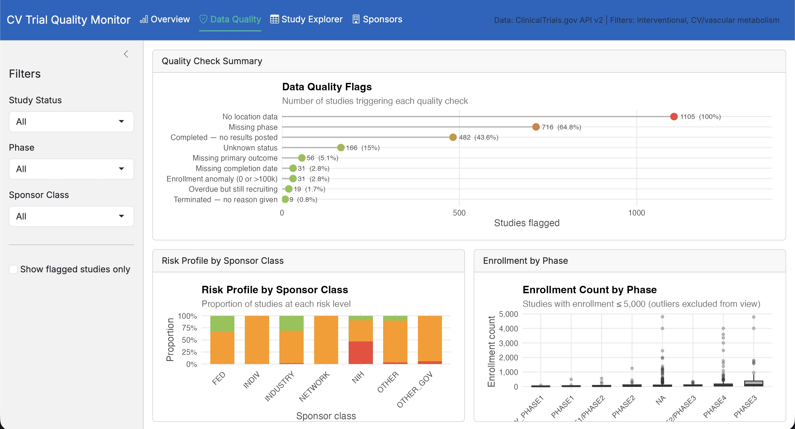

# Clinical Trial Quality Monitor — Cardiovascular & Vascular Metabolism

An R Shiny dashboard for monitoring data quality and study characteristics in cardiovascular and vascular metabolism clinical trials, using the **ClinicalTrials.gov API v2** as a data source.

Built to demonstrate centralized monitoring concepts aligned with **RBQM (Risk-Based Quality Management)** principles — automated flagging, risk scoring, and sponsor-level oversight — using publicly available clinical trial data.

---

## Background

This project draws on my research in vascular mitochondrial metabolism, applying that domain expertise to clinical data quality analysis. Cardiovascular trials are the thematic focus; the data quality framework is generalizable to any therapeutic area.

---

## Features

### Overview Dashboard
- Key metrics: total studies, currently recruiting, high-risk studies, results non-disclosure
- Study status distribution, phase breakdown, start-year timeline by status

### Data Quality Panel
- **9 automated quality checks**, including:
  - Missing completion dates, missing primary outcomes, missing phase classification
  - Overdue studies (past completion date but still RECRUITING)
  - Terminated studies with no reason given
  - Enrollment anomalies (zero or implausibly large)
  - Completed studies with no results posted (>12 months post-completion)
- Composite **risk score** (0–9) and categorical risk level (Clean / Low / Medium / High)
- Risk profile breakdown by sponsor class (INDUSTRY vs NIH vs OTHER)

### Study Explorer
- Full-text search by title keyword
- Multi-dimension filtering: status, phase, enrollment range, risk level
- Color-coded risk table
- **CSV export** of any filtered view

### Sponsor Analysis
- Top 15 sponsors by study volume
- Sponsor class breakdown

---
## Preview



## Technical Stack

| Layer | Tools |
|---|---|
| API access | `httr2` — paginated requests, retry logic, rate limiting |
| Data wrangling | `dplyr`, `tidyr`, `purrr`, `lubridate` |
| Visualisation | `ggplot2` (custom theme), `scales`, `forcats` |
| Interactive app | `shiny`, `bslib` (Bootstrap 5), `bsicons` |
| Tables | `DT` (DataTables with server-side filter) |
| Caching | Local `.rds` cache to avoid redundant API calls |

---

## Project Structure

```
clinical-trial-quality-monitor/
├── app.R
├── fetch_trials.R
├── data_quality.R
├── visualizations.R
├── data/
│   └── trials_cache.rds
└── README.md
```

---

## Quick Start

```r
# Install dependencies
install.packages(c(
  "shiny", "bslib", "bsicons",
  "httr2", "dplyr", "tidyr", "purrr", "lubridate",
  "ggplot2", "scales", "forcats",
  "DT"
))

# Run the app
shiny::runApp("app.R")
```

On first launch the app fetches ~400–600 cardiovascular studies from the ClinicalTrials.gov API and caches them locally. Subsequent launches load from cache (< 1 second).

To refresh data, delete `data/trials_cache.rds` and relaunch.

---

## Data Quality Logic

The quality scoring is inspired by centralized monitoring frameworks used in clinical data management (RBQM / ICH E6(R3)):

| Flag | Rationale |
|---|---|
| `flag_no_completion_date` | Incomplete study metadata; regulatory concern |
| `flag_no_primary_outcome` | Core protocol element — absence is a data integrity issue |
| `flag_no_phase` | Required for regulatory classification |
| `flag_overdue` | Recruiting past expected completion → patient safety signal |
| `flag_terminated_no_reason` | Unexplained termination → transparency concern |
| `flag_enrollment_anomaly` | Extreme values suggest data entry error |
| `flag_no_location` | Missing site data limits oversight |
| `flag_unknown_status` | Ambiguous regulatory status |
| `flag_no_results` | FDAAA 801 / ICMJE requires results within 12 months of completion |

Risk score = count of TRUE flags per study. Risk level: Clean (0) / Low (1) / Medium (2–3) / High (≥4).

---

## Domain Context

Search terms used to identify cardiovascular / vascular metabolism studies:

- Endothelial dysfunction, vascular function
- Oxidative stress + cardiovascular
- Mitochondrial function + cardiovascular
- Metabolic syndrome + cardiovascular
- Hypertension + vascular function
- Atherosclerosis + endothelial

This covers the intersection of vascular biology and metabolic disease — the clinical translation of basic research on vascular mitochondrial metabolism and reactive oxygen species.


